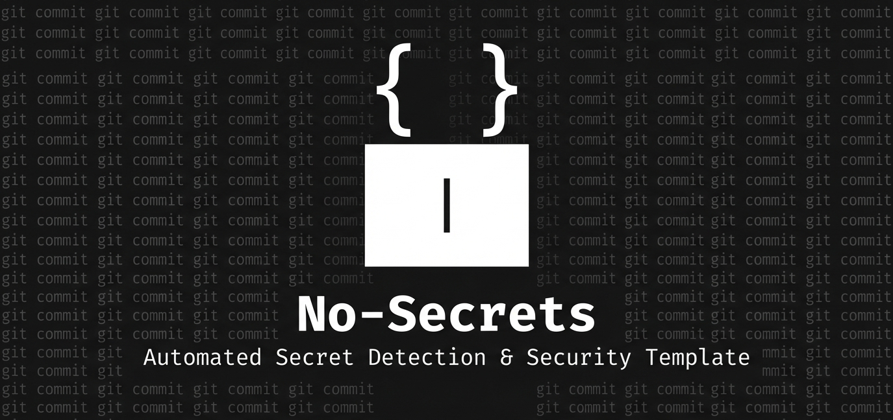
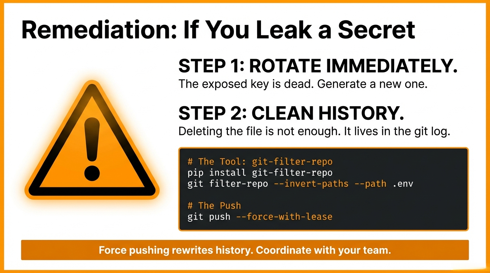

<p align="center">
  
</p>

---

## 🛡️ Why This Matters

A single exposed API key can cost **thousands in unauthorized API usage**. This template prevents that—automatically, on every commit.

**Your secrets stay secret. Your code stays clean.**

---

## 📑 Table of Contents

- [ Quick Start](#-quick-start)
- [What's Included](#️-whats-included)
- [ Available Commands](#-available-commands)
- [ How It Works](#-how-it-works)
- [ Security Features Explained](#-security-features-explained)
- [ What's In The Box](#-whats-in-the-box)
- [ Perfect For](#-perfect-for)
- [ After `make setup`](#️-after-make-setup)
- [ FAQ](#-faq)
- [ If You Think You've Exposed Secrets](#-if-you-think-youve-exposed-secrets)
- [ More Information](#-more-information)
- [ Contributing](#-contributing)
- [ License](#-license)
- [ Learn More](#-learn-more)
- [ Next Steps](#-next-steps)
- [ Questions?](#-questions)

---

## ⚡ Quick Start

https://github.com/nadinev6/no-secrets/assets/demo.mp4

### 🆕 For New Projects

```bash
# 1. # Create from template (choose one)
gh repo create my-project --template=nadinev6/no-secrets --public --clone
gh repo create my-project --template=nadinev6/no-secrets --private --clone
cd my-project

make setup          # Mac/Linux
.\setup.bat setup         # Windows
```

### 📦 For Existing Projects

**Quick Setup (Mac/Linux):**

```bash
# Download config files
curl -O https://raw.githubusercontent.com/nadinev6/no-secrets/main/.gitleaks.toml
curl -O https://raw.githubusercontent.com/nadinev6/no-secrets/main/.gitleaksignore
curl -O https://raw.githubusercontent.com/nadinev6/no-secrets/main/.pre-commit-config.yaml

# Add GitHub Actions workflow
mkdir -p .github/workflows
curl -o .github/workflows/secret-scan.yml https://raw.githubusercontent.com/nadinev6/no-secrets/main/.github/workflows/secret-scan.yml

# Install and activate
pip install pre-commit
pre-commit install
```

**Windows Users:**

```powershell
curl.exe -O https://raw.githubusercontent.com/nadinev6/no-secrets/main/.gitignore
curl.exe -O https://raw.githubusercontent.com/nadinev6/no-secrets/main/.gitleaks.toml
curl.exe -O https://raw.githubusercontent.com/nadinev6/no-secrets/main/.gitleaksignore
curl.exe -O https://raw.githubusercontent.com/nadinev6/no-secrets/main/.pre-commit-config.yaml
curl.exe -O https://raw.githubusercontent.com/nadinev6/no-secrets/main/setup.bat

mkdir .github\workflows
curl.exe -o .github/workflows/secret-scan.yml https://raw.githubusercontent.com/nadinev6/no-secrets/main/.github/workflows/secret-scan.yml

pip install pre-commit
python -m pre_commit install
```

**That's it!** Your existing project now has secret detection enabled.

> **💡 Tip:** After setup, run `python -m pre_commit run --all-files` (Windows) or `pre-commit run --all-files` (Mac/Linux) to scan all existing files for secrets.

# Done! 🎉

> **⚠️ Important:** If you already committed files that should be ignored (like `node_modules`, `.env` files, etc.), they'll remain in git history even after adding `.gitignore`.
> 
> **To remove them:**
> ```bash
> # Remove from git tracking (but keep local files)
> git rm -r --cached node_modules
> git rm --cached .env
> 
> # Commit the removal
> git commit -m "Remove ignored files from git tracking"
> ```
> 
> For sensitive files already in history, see the [🚨 If You Think You've Exposed Secrets](#-if-you-think-youve-exposed-secrets) section.


## 🛡️ What is Included

This template comes pre-configured with industry best practices.

### Local Protection

- ✅ **Pre-commit hooks** - Detects secrets before they're committed
- ✅ **Gitleaks integration** - Scans ALL files including `.env.example` for real secrets
- ✅ **Automatic validation** - Checks file sizes, YAML syntax, trailing whitespace
- ✅ **Pattern detection** - Catches API keys, passwords, tokens, private keys (120+ patterns)
- ✅ **Smart allowlisting** - Auto-allows obvious fake patterns like "test", "example", "fake"
- ✅ **Comprehensive .gitignore** - Blocks all `.env.*` files and credential JSONs (including `.env.production`, `credentials.json`, service accounts)
- ✅ **Example file support** - Allows `.env.example` and `*.example.json` for documentation

### Server-Side Protection

- ✅ **GitHub Actions** - Continuous secret scanning on every push
- ✅ **Branch protection** - Blocks merges with detected secrets
- ✅ **Audit trail** - See what was scanned and when

### Developer Experience

- ✅ **One-command setup** - `make setup` auto-detects and configures everything
- ✅ **Prerequisites checker** - Verifies all required tools before setup
- ✅ **Smart error messages** - Clear guidance when tools are missing
- ✅ **Comprehensive .gitignore** - Covers environment files (`.env.*`), credentials (`*credentials*.json`, `*secret*.json`), and key files (`.pem`, `.key`, etc.)
- ✅ **Helpful commands** - `make help` shows all available commands

## 📋 Available Commands

**Mac/Linux (using Makefile):**
```bash
make setup                # Auto-detect and setup everything (recommended!)
make check-prereqs        # Check if required tools are installed
make init                 # Initialize project with pre-commit only
make setup-python         # Setup Python virtual environment
make setup-node           # Setup Node.js dependencies
make setup-go             # Setup Go environment
make lint                 # Run all linters
make test                 # Run project tests
make clean                # Remove Python/Node.js caches
make help                 # Show all available commands
```

**Windows (using setup.bat):**
```powershell
setup.bat setup           # Auto-detect and setup everything (recommended!)
setup.bat check-prereqs   # Check if required tools are installed
setup.bat init            # Initialize project with pre-commit only
setup.bat setup-python    # Setup Python virtual environment
setup.bat setup-node      # Setup Node.js dependencies
setup.bat setup-go        # Setup Go environment
setup.bat lint            # Run all linters
setup.bat test            # Run project tests
setup.bat clean           # Remove Python/Node.js caches
setup.bat help            # Show all available commands
```

For a complete overview, run: `make help` (Mac/Linux) or `setup.bat help` (Windows)

---

## 🚨 How It Works

### Scenario: You Accidentally Add an API Key

You create a config file with secrets:

```bash
cat > config.json << 'EOF'
{
  "api_key": "sk-1234567890abcdef",
  "database_password": "my-secret"
}
EOF
```

You try to commit it:

```bash
git add config.json
git commit -m "Add config"
```

⚠️ Pre-commit hook BLOCKS your commit:

```
Error: Gitleaks found potential secrets:
  - config.json: AWS_SECRET_ACCESS_KEY detected
```

You fix it:

```bash
echo "config.json" >> .gitignore
git commit -m "Add config to gitignore"
```

✅ Now it works:

```
[main abc1234] Add config to gitignore
```

**Key Point:** Secrets never make it into git history.

---

## 🔑 Security Features Explained

### Pre-commit Hooks (Local)

Runs on your machine before each commit. Detects:

- AWS keys, Google API keys, GitHub tokens
- Database connection strings with passwords
- Private SSH/PGP keys
- Slack/Discord webhooks
- Generic patterns (anything that looks like a secret)

**Note:** Can be bypassed with `git commit --no-verify` (not recommended!)

### GitHub Actions (Server)

Runs on GitHub's servers on every push/PR. Benefits:

- **Can't be bypassed** (runs on server, not your machine)
- **Team enforcement** - Everyone's commits are scanned
- **Blocks PRs** - Can't merge code with secrets
- **Audit logs** - Track what was scanned

### Branch Protection (Optional)

Add this in your repo settings for extra safety:

1. Settings → Branches → Add rule
2. Require status checks to pass before merging
3. Select the "Detect Secrets" workflow

---

## 📁 What's In The Box

```
your-project/
├── Makefile                          # Make commands (Mac/Linux)
├── setup.bat                         # Batch commands (Windows)
├── .gitignore                        # Ignore secrets, cache, OS files
├── .gitleaksignore                   # Allowlist for fake/test secrets
├── .gitleaks.toml                    # Gitleaks configuration
├── .pre-commit-config.yaml           # Local security hooks
├── .github/
│   └── workflows/
│       └── secret-scan.yml           # GitHub Actions workflow
├── README.md                         # Your project docs
└── [your project files here]
```

---

## 🎯 Perfect For

- **Solo developers** - Prevent accidental secret commits
- **Small teams** - Enforce security across the team
- **Open source projects** - Prevent exposure of private keys
- **Learning projects** - Build good habits from day one
- **Freelancers** - Client projects with sensitive data
- **Anyone** - Really, this should be your default setup

---

## ⚙️ After `make setup`

Once you run `make setup`, you have:

1. **Prerequisites verified** - All required tools checked
2. **Pre-commit framework installed** - Runs on every commit
3. **Gitleaks installed** - Detects 120+ secret patterns
4. **Standard hooks active** - File validation, formatting checks, secret detection
5. **Language environment ready** - Auto-detected and configured (Python venv/Node modules/Go deps)
6. **Initial scan complete** - All existing files checked

### What Gets Auto-Detected

**Python projects:** Looks for `requirements.txt`, `setup.py`, `pyproject.toml`, or `Pipfile`
- Creates virtual environment (`venv/`)
- Installs dependencies if requirements.txt exists

**Node.js projects:** Looks for `package.json`
- Runs `npm install` automatically

**Go projects:** Looks for `go.mod` or `go.sum`
- Downloads dependencies with `go mod download`

### Manual Language Setup

If auto-detection doesn't work or you want specific setup:

**Python:**
```bash
# Mac/Linux:
make setup-python
source venv/bin/activate

# Windows:
setup.bat setup-python
venv\Scripts\activate
```

**Node.js:**
```bash
# Mac/Linux:
make setup-node

# Windows:
setup.bat setup-node
```

**Go:**
```bash
# Mac/Linux:
make setup-go

# Windows:
setup.bat setup-go
```

---

## 🤔 FAQ

### Q: Can I still commit my .env file?

**A:** No, that's the point! The `.gitignore` blocks all `.env.*` files (including `.env.production`, `.env.development`, etc.). Use `.env.example` with placeholder values for documentation - example files are allowed by design.

### Q: What if I need to bypass the hook?

**A:** You can with `git commit --no-verify`, but don't. If the hook is blocking you, it's for a good reason.

**For fake/test secrets:** Use one of these methods:
1. **Inline comment**: `const fakeKey = "sk-test123"; // gitleaks:allow`
2. **Add to .gitleaksignore**: Copy the fingerprint from the error and add it with a comment
3. **Use obvious fake patterns**: Words like "example", "test", "fake" in the value are auto-allowed

Example in `.env.example`:
```
API_KEY=your_api_key_here          # ✅ Safe - obvious placeholder
API_KEY=sk-test-fake-key-12345     # ✅ Safe - contains "test" and "fake"
API_KEY=sk-1a2b3c4d5e6f7g8h9i       # ❌ Blocked - looks real!
```

### Q: Does this work on Windows?

**A:** Yes! Pre-commit hooks work perfectly on Windows, macOS, and Linux.

**For Windows users, you have 3 options:**

1. **Use the provided setup.bat file (Recommended):**
   ```powershell
   setup.bat setup
   ```
   This batch file provides all the same functionality as the Makefile.

2. **Use WSL (Windows Subsystem for Linux):**
   ```bash
   make setup
   ```
   WSL includes `make` by default and works exactly like Mac/Linux.

3. **Install Make for Windows:**
   - Via Chocolatey: `choco install make`
   - Via Scoop: `scoop install make`
   - Or run commands directly: `pip install pre-commit && pre-commit install`

### Q: What about existing repositories?

**A:** Yes! See the [Quick Start section](#-quick-start) for step-by-step instructions on adding this to an existing project. For cleaning existing secrets from history, see the section below on removing secrets.

### Q: Can I customize the rules?

**A:** Yes! Edit `.pre-commit-config.yaml` to add/remove hooks. See [pre-commit.com](https://pre-commit.com) for options.

---

## 🚨 If You Think You've Exposed Secrets

<p align="center">
  
</p>


If you suspect you've already committed secrets, scan your history:

```bash
gitleaks detect --source local
```

If you find exposed secrets:

1. **Immediately rotate** the exposed API key/password
2. **Remove from history** using `git filter-repo`
3. **Force push** (only if private repo or with team agreement)

### Option 1: Using git-filter-repo (Recommended)

Install git-filter-repo:

```bash
pip install git-filter-repo
```

Remove .env from all commits:

```bash
git filter-repo --invert-paths --path .env
```

Force push:

```bash
git push origin --force-with-lease
```

### Option 2: Using BFG

Install BFG:

```bash
brew install bfg
```

Remove all .env files:

```bash
bfg --delete-files .env my-repo.git
```

Force push:

```bash
git push origin --force-with-lease
```

**⚠️ WARNING:** Force pushing rewrites history. Only do this on private repos with team agreement.


---

## 📚 More Information

- **Pre-commit docs:** https://pre-commit.com
- **Gitleaks:** https://github.com/gitleaks/gitleaks
- **GitHub secret scanning:** https://docs.github.com/en/code-security/secret-scanning
- **OWASP secrets management:** https://cheatsheetseries.owasp.org/cheatsheets/Secrets_Management_Cheat_Sheet.html

---

## 🤝 Contributing

Found an issue or have a suggestion?

- Fork this template
- Make improvements
- Submit a PR

Great improvements to consider:

- Additional secret patterns
- Support for more languages
- Better documentation
- New Makefile commands

---

## 📝 License

MIT - Use freely, modify as needed

---

## 🎓 Learn More

This template helps you follow these best practices:

- ✅ Never commit secrets to git
- ✅ Use environment variables for configuration
- ✅ Rotate credentials regularly
- ✅ Audit git history for leaks
- ✅ Implement layered security (local + server)

**Real-world impact:** This prevents the situation where an API key sits in git history for months before being discovered.

---

## 🚀 Next Steps

1. **Use this template** for your next project
2. **Run setup immediately** after cloning (one command does it all!)
   - Mac/Linux: `make setup`
   - Windows: `setup.bat setup`
3. **Add this to your standard process** - always use this template
4. **Share with your team** - everyone should use it
5. **Star this repo** if it helps you! ⭐

---

## 👤 Questions?

- Check the [GitHub Issues](../../issues)
- Review the [Discussions](../../discussions)
- See existing [PRs](../../pulls)

Happy and secure coding! 🔒

---


